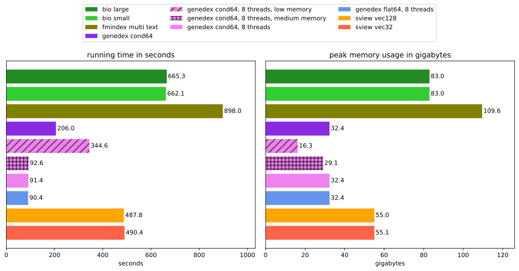
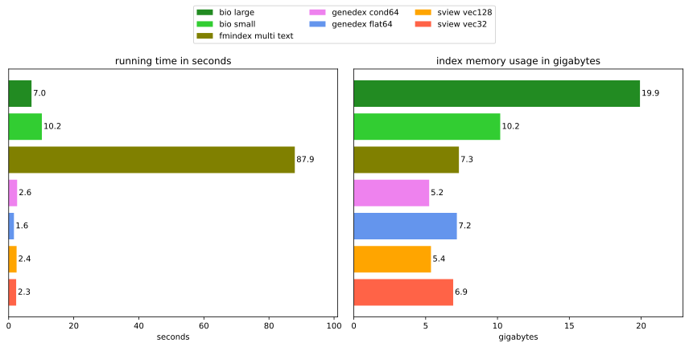
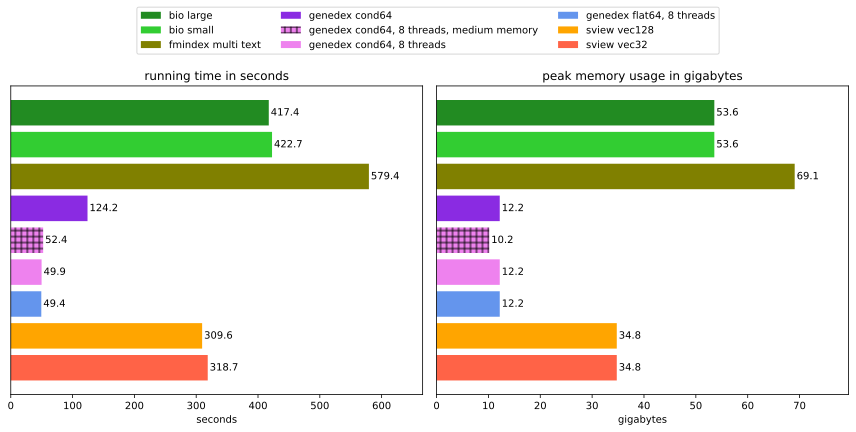
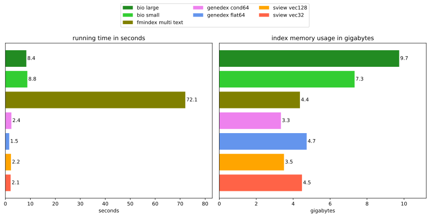
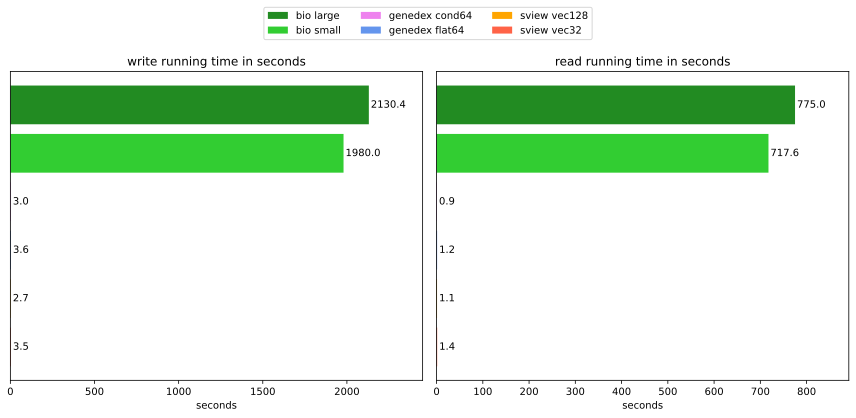
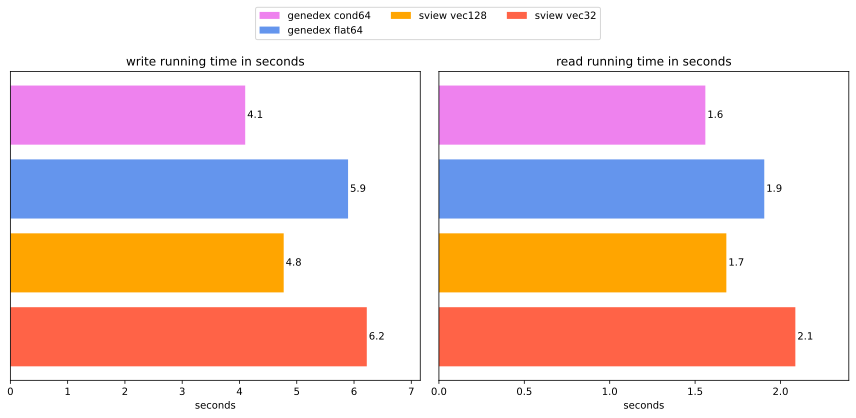
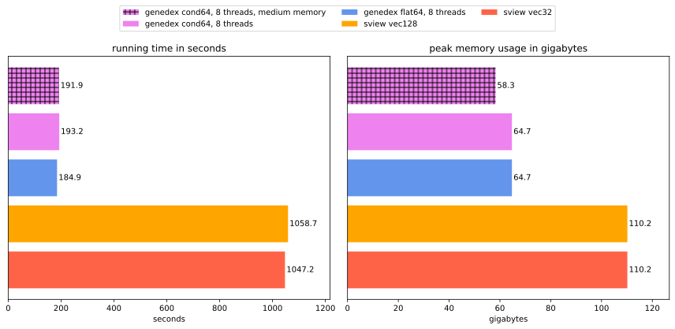
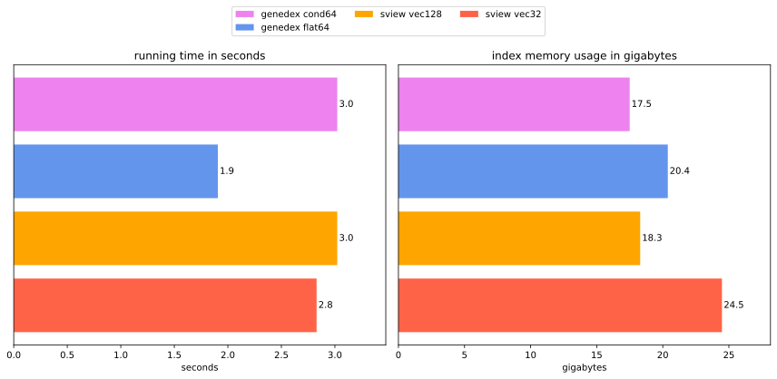
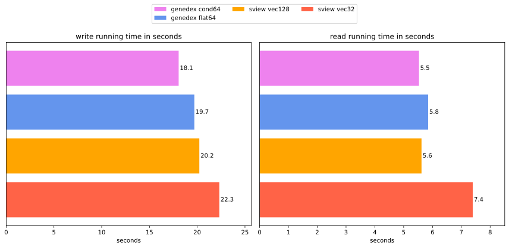

# Rust FM-Index Benchmark📋

## Background

The [FM-Index] is a full-text index data structure that allows efficiently counting and retrieving the positions of all occurrenes of (typically short) sequences in very large texts. It is widely used in sequence analysis and bioinformatics. This document provides a thorough comparison of all of the existing Rust implementations of the FM-Index. **Bias alert:** I am the author of [`genedex`].

## Existing Libraries

Libraries were gathered from [crates.io](crates.io) searches of "fmindex" and "fm index". The library [`lt-fm-index`] was excluded, because it seems to be a predecessor of [`sview-fmindex`]. The analysis was done to the best of my ability. If I made a mistake in using/analyzing any of the libraries, please let me know. 

* [`awry`]\: There are currently some issues with this library and it is excluded until they are resolved.
* [`fm-index`]\: Does not seem to be designed for maximum performance, but offers multiple interesting variants of the FM-Index.
* [`genedex`]\: Offers multiple different implementations of the basic FM-Index. `flat64` and `cond64` were chosen for this benchmark. Also, it allows trading off running time and memory usage during index construction.
* [`rust-bio`]\: A large library with many different data structures. The basic FM-Index allows choosing a sampling rate of the occurrence table. A larger sampling rate leads to a smaller index, but slower running times of the search operations. Two different sampling rates were compared in this benchmark, 32 (referred to as `bio large`) and 2048 (referred to as `bio small`).
* [`sview-fmindex`]\: Implements the FM-Index for different underlying `Vector` types that represent different time/space tradeoffs. `u32` (referred to as `vec32`) and `u128` (referred to as `vec128`) were chosen for this benchmark.

### Feature Comparison

- **Good construction memory usage:** FM-Indices always need a lot of memory during construction, mainly because a suffix array has to be constructed for the text. However, 6 or 10 times the memory usage of the input text should be sufficient (`u8` text + `u8` BWT + 32/64 bit suffix array). The numbers displayed were measured for the construction of the index for the human reference genome.
- **Multiple texts:** The library directly supports indexing multiple texts, such as a genome with multiple chromosomes.
- **Disk I/O:** The library supports writing the index to disk and restoring it after. The warning sign is used to indicate that the library supports it, but it is very slow (usually due to the usage of slow serializers). [`rust-bio`] was used with one of the fastest `serde` (de)serializer libraries, [`bincode`]. I tried multiple (de)serializer libraries, and none of them was fast. Most of them seem to be optimized for small serialized output and not serialization running time.
- **Disk I/O `mmap`:** Allows writing and reading the index directly to/from memory mapped buffers. Not the most important feature, but might be useful for very specific applications.
- **Multithreaded construction:** Not the most important feature, but nice to have. Even for [`genedex`], the scaling of the parallelization is far from optimal.

| **Library** | **Good construction memory usage** | **Multiple texts** |  **Disk I/O** | **Disk I/O `mmap`** |**Multithreaded construction** | 
| ----------- | :-------------: | :-------------: | :-------------: | :-------------: |  :-------------: |
| [`awry`]          | ❌ (18x) | ✅ | ⚠️ | ❌ | ✅ (unsure) |
| [`fm-index`]      | ❌ (34x) | ✅ | ❌ | ❌ | ❌ |
| [`genedex`]       | ✅ (5-6x/9-10x)* | ✅ | ✅ | ❌ | ✅ |
| [`rust-bio`]      | ❌ (26x) | ❌  | ⚠️ | ❌ | ❌ |
| [`sview-fmindex`] | ❌ (17x) | ❌ | ✅ | ✅ | ❌ |

*: depending on the input size and configuration.

## Benchmark Setup

### Input data

These different input texts to be indexed are used in the benchmark:

* [`hg38`]: The human reference genome with a total size of roughly 3.3 GB. Implementations can use `u32` to store text positions.
* `i32`: The first 20 records of the `hg38` file with a total size of roughly 2 GB. This allows implementation to use `i32` to store text positions, which mainly is useful for interop with C-based suffix array construction algorithms.
* `double-hg38`: The human genome concatenated with its reverse complement. A total size of 6.6 GB, which forces implementations to use 64 bit ints to store text positions (or use bitcompressed ints).

As queries, a sample of (quite short) Illumina [reads from SRA], truncated to length 50 is used. Truncating to this length makes sure that for many of the queries, at least one occurrence exists in the text. The summed up length of all queries is 377 MB.

### Benchmarked Functionality and Parameters

First, the FM-Index for the given input texts is constructed. If the library doesn't support multiple texts, the texts are concatenated. The suffix array sampling rate is set to 4 for all of the libraries (retains 1/4 of entries). If the library supports building a precomputed lookup table, the depth 10 is chosen. 

Then, the queries are searched, either by only counting occurrences, or by also locating the positions of occurrences. (In this benchmark, there was no large difference between the count and locate runs. Therefore, only the results for locating are displayed here and the other results can be found in the `plots/img` folder.)

If the library supports it, the time to write the index to disk and then it read back into memory is also measured.

### Hardware

Intel(R) Xeon(R) Gold 6348 server CPU @ 2.60GHz with two sockets of 28 cores, AVX512 support and 1 TB of RAM.

## Main Results

### `hg38` Construction

The running time and peak memory usage of constructing the FM-Index for the `hg38` input using the different implementations can be seen below. For `genedex`, results are shown with and without threading, as well as for different memoriy configurations.



### `hg38` Locate

The running time of searching the queries in the `hg38` input and memory usage of the index can be seen below.



All of the other results can be found [below](#detailed-results).

## Limitations

Currently, this benchmark only supports implementations of the basic FM-Index in Rust. Only a single common type of input text and queries is used (genomic data). It would be interesting to compare the implementations for different kinds of queries, or on a totally different text input with a larger alphabet than DNA. Also, the hardware might play a significant role in how the faster implementations perform.

## Run the Benchmark

To run this benchmark, clone the repository, download the input texts and queries, and create a folder structure in the repository like this:

```
data/
    hg38.fna <- renamed downloaded reference genome
    reads.fastq <- renamed downloaded SRA reads
```

Support for other input texts could easily be added in the future, bit doesn't exist yet. If you're familiar with the `just` command runner, you can simply run `just` to run the benchmarks and then execute `main.py` from the `plots` folder to generate the plots (requires `matplotlib`). Otherwise you can build and run the executable using cargo and run the commands from the `justfile` manually.

## Add a Library to the Benchmark

Adding a library to the benchmark should not be too difficult. First, add it as a dependency and implement the `BenchmarkFmIndex` trait from `common_interface.rs`. You can use the implementations for the other libraries as examples. Then, add a new variant to the `Library` enum in `main.rs` and fix the `match` statement you just broke, using the `BenchmarkFmIndex` implementation of your libary. Finally, choose your favorite color and register your library in the `plots/main.py` script.

## Detailed Results

### `i32` Construction



### `i32` Locate



### `i32` File IO



### `hg38` File IO



### `double-hg38` Construction



### `double-hg38` Locate



### `double-hg38` File IO



[`awry`]: https://github.com/UM-Applied-Algorithms-Lab/AWRY
[`bincode`]: https://sr.ht/~stygianentity/bincode/
[`fm-index`]: https://github.com/ajalab/fm-index
[`genedex`]: https://github.com/feldroop/genedex
[`rust-bio`]: https://github.com/rust-bio/rust-bio
[`lt-fm-index`]: https://github.com/baku4/lt-fm-index/
[`sview-fmindex`]: https://github.com/baku4/sview-fmindex

[FM-Index]: https://doi.org/10.1109/SFCS.2000.892127
[`hg38`]: https://www.ncbi.nlm.nih.gov/datasets/genome/GCF_000001405.38/
[reads from SRA]: https://www.ncbi.nlm.nih.gov/sra/ERX14765811
